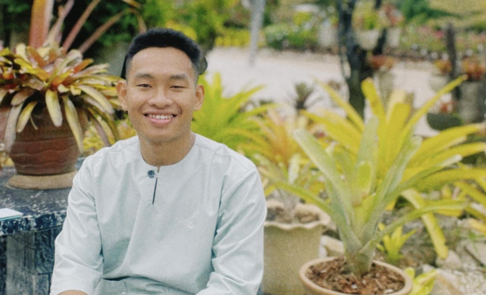

## Afiq Nadzmi⚪🔴⚫

I’m a software engineering student, currently taking the Software Maintenance and Evolution course in my final semester at Universiti Malaya. My expectation when enrolling in this course was to gain a clear understanding of how to properly manage maintenance and evolution processes in the IT world. I believe that with this knowledge in hand, I can open more doors to success in the future.

Fun fact: I got Chinese bloodline🩸

## GitHub Profile
Link [here](https://github.com/afiqnadzmii)
